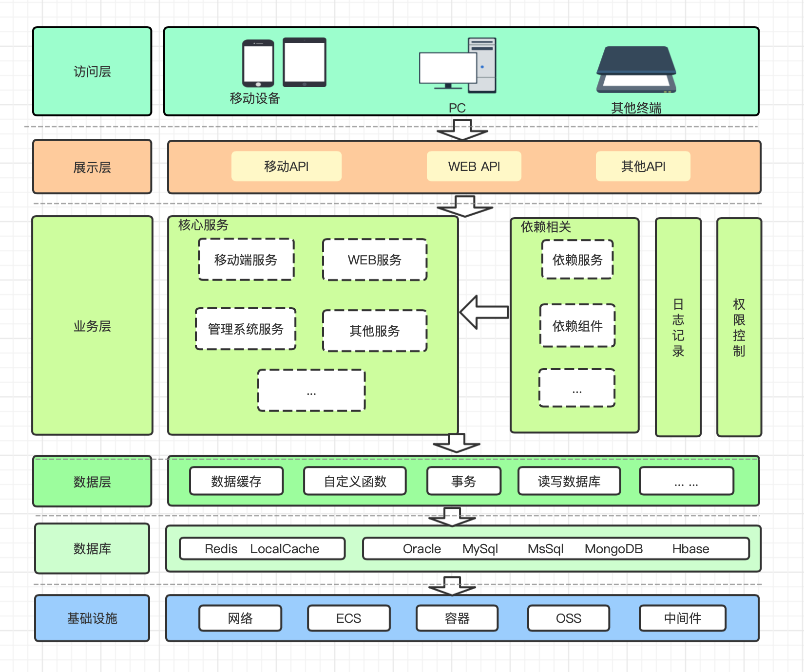
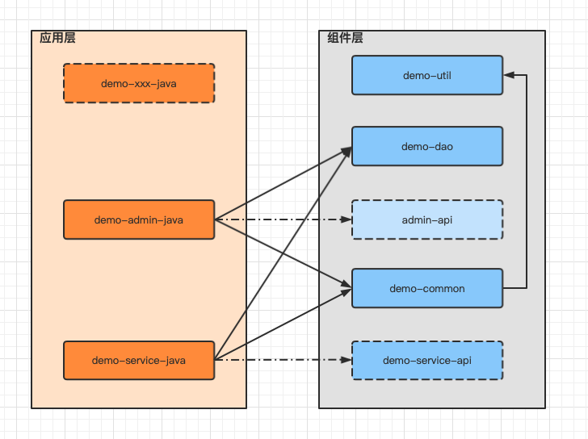

## spring-simple-framework架构

### 架构目标
1. 基于工程命名不够规范，制定工程命名规约，提升识别性
2. 规范技术架构定义，方便后续可读性、维护性及扩展性
3. 规范模块结构定义，方便新人快速理解上手
4. 降低架构初始化及常用组件的接入成本，提升研发效率

### 应用架构


### 模块说明
- spring-archetype-parent：archetype模板工程，用来创建后端服务的`archetype`
- spring-simiple-demo：archetype模板源码，基于源码可以优化升级模板工程

### 依赖组件
- 当前工程依赖了一些常用组件，避免重复造轮子，代码结构更统一，可以提升研发效率
- 组件源码参考：[guanyang/spring-base-parent](https://github.com/guanyang/spring-base-parent)

| 组件模块(artifactId)  | 说明          | 备注                                                     |
|-------------------|-------------|--------------------------------------------------------|
| spring-base-core  | 基础核心定义      | [参考文档](https://github.com/guanyang/spring-base-parent) |
| spring-base-util  | 常用工具类合集     | [参考文档](https://github.com/guanyang/spring-base-parent) |
| spring-base-csrf  | csrf组件      | [参考文档](https://github.com/guanyang/spring-base-parent) |
| spring-base-sign  | 接口签名组件      | [参考文档](https://github.com/guanyang/spring-base-parent) |
| spring-base-xss   | 接口参数xss校验组件 | [参考文档](https://github.com/guanyang/spring-base-parent) |
| spring-base-lock  | 分布式锁组件      | [参考文档](https://github.com/guanyang/spring-base-parent) |
| spring-base-log   | 日志组件        | [参考文档](https://github.com/guanyang/spring-base-parent) |
| spring-base-limit | 限流组件        | [参考文档](https://github.com/guanyang/spring-base-parent) |

### 快速使用指南
#### 应用工程架构
- [模块定义说明](spring-simple-demo/README.md)



#### 相关依赖
- 本工程依赖[guanyang/spring-base-parent](https://github.com/guanyang/spring-base-parent) 相关组件
- 将`spring-base-parent`下载到本地，执行`mvn clean install`，将相关组件生成到本地

#### 基于模板创建应用
- 将archetype模板生成到本地
```
mvn clean install
```
- 基于archetype模板创建工程，命令如下：

``` 
mvn archetype:generate  \
    -DgroupId=org.gy.framework \					//替换成自定义groupId
    -DartifactId=spring-demo-01 \					//替换成自定义artifactId
    -Dversion=1.0.0-SNAPSHOT \					//替换成自定义version				
    -Dpackage=org.gy.framework.demo \			//替换成自定义package路径
    -DarchetypeArtifactId=spring-archetype-service \		//该模板已经上传私服，直接使用
    -DarchetypeGroupId=org.gy.framework \
    -DarchetypeVersion=1.0.0-SNAPSHOT
``` 
#### 本地调试开发
- 初次启动【xxx-service-java】，需要调整数据源配置，否则启动报错
  - 数据源配置路径：xxx-service-java/src/main/resources/application-live.yml
- 该框架已经默认引入`mybatis plus`中间件，支持代码自动生成及数据源常用配置
  - 代码自动生成入口：xxx-dao/src/test/java/${package}.dao/MybatisAutoGeneratorHelper.java
  - mybatis-plus常用配置入口：xxx-service-java/src/main/resources/application.yml，一般不需要修改，默认即可
- 代码自动生成使用说明，只需要调整以下变量即可，其他可以保持不变，入口类：`MybatisAutoGeneratorHelper`
  - url：数据源地址
  - username：数据库用户名
  - password：数据库密码
  - author：代码生成者名字，仅作标识而已，可随意指定
  - tableNames：要生成的数据库表名，可以指定多个

### 相关文档
- [Maven Archetype搭建模板工程](https://note.xcloudapi.com/2021/11/22/Maven-Archetype%E6%90%AD%E5%BB%BA%E6%A8%A1%E6%9D%BF%E5%B7%A5%E7%A8%8B/)

### Change Log
#### 1.0.0-SNAPSHOT
- 统一架构分层结构定义，方便扩展及治理
- API统一异常、错误码规范定义，参考ApiBizException
- 统一全局异常处理器，参考ServiceExceptionHandler
- 引入`mybatis plus`中间件，支持代码自动生成及数据源常用配置，代码自动生成参考`MybatisAutoGeneratorHelper`
- 支持csrf、xss安全加固，参考示例`TestController`
  - 在需要csrf验证的Controller方法加上@CsrfCheck注解
  - 请求对象需要添加`@Valid`或者`@Validated`注解才会进行xss校验
- 支持traceid和日志切面记录方法调用日志，参考示例`TestController`
  - 日志`@LogTrace`支持类、方法层级定义